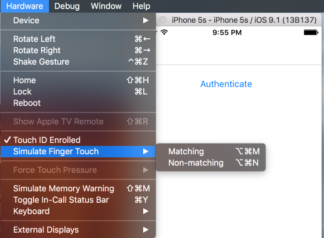

#  Fingerprint plugin for Xamarin 

Xamarin and MvvMCross plugin for accessing the fingerprint sensor.

| Type  | Stable | Pre release |
| ------------- | ----------- | ----------- |
| vanilla | [](https://www.nuget.org/packages/Plugin.Fingerprint/) | [](https://www.nuget.org/packages/Plugin.Fingerprint/) |
| MvvmCross | [](https://www.nuget.org/packages/MvvmCross.Plugins.Fingerprint/) | [](https://www.nuget.org/packages/MvvmCross.Plugins.Fingerprint/) |

[Changelog](doc/changelog.md)

## Support

| Platform  | Version |
| ------------- | ----------- |
| Xamarin.Android | 4.4 |
| Xamarin.iOS     | 8.0 |
| Xamarin.Mac     | 10.12 |
| Windows UWP     | 10  |

## Usage
### API
The API is defined by the ```IFingerprint``` interface:

```csharp
/// <summary>
/// Checks the availability of fingerprint authentication.
/// Checks are performed in this order:
/// 1. API supports accessing the fingerprint sensor
/// 2. Permission for accessint the fingerprint sensor granted
/// 3. Device has sensor
/// 4. Fingerprint has been enrolled
/// <see cref="FingerprintAvailability.Unknown"/> will be returned if the check failed 
/// with some other platform specific reason.
/// </summary>
Task<FingerprintAvailability> GetAvailabilityAsync();

/// <summary>
/// Checks if <see cref="GetAvailabilityAsync"/> returns <see cref="FingerprintAvailability.Available"/>.
/// </summary>
/// <returns><c>true</c> if Available, else <c>false</c></returns>
Task<bool> IsAvailableAsync();

/// <summary>
/// Requests the authentication.
/// </summary>
/// <param name="reason">Reason for the fingerprint authentication request. Displayed to the user.</param>
/// <param name="cancellationToken">Token used to cancel the operation.</param>
/// <returns>Authentication result</returns>
Task<FingerprintAuthenticationResult> AuthenticateAsync(string reason, CancellationToken cancellationToken = default(CancellationToken));

/// <summary>
/// Requests the authentication.
/// </summary>
/// <param name="authRequestConfig">Configuration of the dialog that is displayed to the user.</param>
/// <param name="cancellationToken">Token used to cancel the operation.</param>
/// <returns>Authentication result</returns>
Task<FingerprintAuthenticationResult> AuthenticateAsync(AuthenticationRequestConfiguration authRequestConfig, CancellationToken cancellationToken = default(CancellationToken));
```

The returned ```FingerprintAuthenticationResult``` contains information about the authentication.
```csharp
/// <summary>
/// Indicatates whether the authentication was successful or not.
/// </summary>
public bool Authenticated { get { return Status == FingerprintAuthenticationResultStatus.Succeeded; } }

/// <summary>
/// Detailed information of the authentication.
/// </summary>
public FingerprintAuthenticationResultStatus Status { get; set; }

/// <summary>
/// Reason for the unsucessful authentication.
/// </summary>
public string ErrorMessage { get; set; }
```

### Example
#### vanilla
```csharp
var result = await CrossFingerprint.Current.AuthenticateAsync("Prove you have fingers!");
if (result.Authenticated)
{
    // do secret stuff :)
}
else
{
    // not allowed to do secret stuff :(
}
```

#### using MvvMCross
```csharp
var fpService = Mvx.Resolve<IFingerprint>(); // or use dependency injection and inject IFingerprint

var result = await fpService.AuthenticateAsync("Prove you have mvx fingers!");
if (result.Authenticated)
{
    // do secret stuff :)
}
else
{
    // not allowed to do secret stuff :(
}
```

### iOS
#### Limitations

You can't create a custom dialog. The standard iOS Dialog will be shown.

##### iOS 9+ only
- cancelable programmatically with passed CancellationToken
- custom fallback button title

##### iOS 10+ only
- custom cancel button title

### Android
#### Setup
**Set Target SDK version**

The target SDK version has to be >= 6.0. I recomment to use always the latest stable SDK version, if possible. You can set the target SDK version in your Android project properties.

**Request the permission in AndroidManifest.xml**

The first line is for the standard Android API and the second for Samsung devices using the Pass API.

```xml
<uses-permission android:name="android.permission.USE_FINGERPRINT" />
<uses-permission android:name="com.samsung.android.providers.context.permission.WRITE_USE_APP_FEATURE_SURVEY" />
```
**Set the resolver of the current Activity**

Skip this, if you use the MvvMCross Plugin or don't use the dialog.

We need the current activity to display the dialog. You can use the [Current Activity Plugin](https://github.com/jamesmontemagno/Xamarin.Plugins/tree/master/CurrentActivity) from James Montemagno or implement your own functionality to retrieve the current activity. See Sample App for details.
```csharp
CrossFingerprint.SetCurrentActivityResolver(() => CrossCurrentActivity.Current.Activity);
```
#### Configuration

If you don't like the default dialog, you can easily customize it. You have to inherit from `FingerprintDialogFragment` e.g. like:
```csharp
public class MyCustomDialogFragment : FingerprintDialogFragment
{
    public override View OnCreateView(LayoutInflater inflater, ViewGroup container, Bundle savedInstanceState)
    {
        var view = base.OnCreateView(inflater, container, savedInstanceState);
        view.Background = new ColorDrawable(Color.Magenta); // make it fancyyyy :D
        return view;
    }
}
```

And somewhere in your code set your custom dialog fragment:
```csharp
CrossFingerprint.SetDialogFragmentType<MyCustomDialogFragment>();
```

## Testing on Simulators
### iOS


With the Hardware menu you can
* Toggle the enrollment status
* Trigger valid (<kbd>⌘</kbd> <kbd>⌥</kbd> <kbd>M</kbd>) and invalid (<kbd>⌘</kbd> <kbd>⌥</kbd> <kbd>N</kbd>) fingerprint sensor events

### Android
* start the emulator (Android >= 6.0)
* open the settings app
* go to Security > Fingerprint, then follow the enrollment instructions
* when it asks for touch
 * open command prompt
 * `telnet 127.0.0.1 <emulator-id>` (`adb devices` prints "emulator-&lt;emulator-id&gt;")
 * `finger touch 1`
 * `finger touch 1`

Sending fingerprint sensor events for testing the plugin can be done with the telnet commands, too.

**Note for Windows users:**
You have to enable telnet: Programs and Features > Add Windows Feature > Telnet Client

## Nice to know

### ProGuard

If you use the plugin with Link all, Release Mode and ProGuard enabled, you may have to add the follwoing rules to your proguard.cfg.

    -dontwarn com.samsung.**
    -keep class com.samsung.** {*;}

## Contribution
 + 
